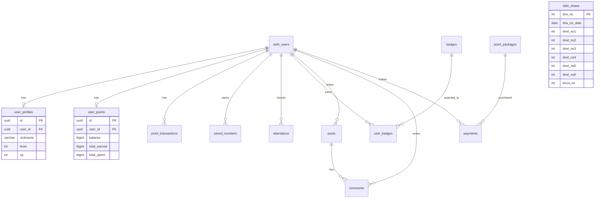

# 03. 데이터베이스 스키마

## 🗄️ 데이터베이스 개요

**Supabase PostgreSQL** 기반의 데이터베이스로, Row Level Security(RLS)를 활용한 보안 정책을 적용합니다.

---

## 📊 ERD (Entity Relationship Diagram)



---

## 📁 SQL 파일 관리 전략

### 파일 목록 & 실행 순서

| 순서 | 파일 | 설명 |
|-----|------|------|
| 1 | `create-admin-table.sql` | 관리자 테이블 |
| 2 | `create-lotto-draws-table.sql` | 로또 당첨 데이터 |
| 3 | `create-points-tables.sql` | 포인트 시스템 (3개 테이블) |
| 4 | `create-gamification-tables.sql` | 레벨, 뱃지 시스템 |
| 5 | `create-attendance-table.sql` | 출석 체크 |
| 6 | `create-saved-numbers-table.sql` | 저장된 번호 |
| 7 | `create-community-tables.sql` | 게시판, 댓글 |
| 8 | `create-payments-table.sql` | 결제 내역 |
| 9 | `create-weekly-reports-table.sql` | 주간 리포트 |
| 10 | `create-point-functions.sql` | 포인트 함수 |
| 11 | `create-xp-function.sql` | XP 함수 |
| 12 | `create-signup-bonus-trigger.sql` | 가입 보너스 트리거 |
| 13 | `fix-final-rls.sql` | RLS 정책 수정 |

---

## 🔐 주요 테이블 상세

### lotto_draws (로또 당첨 데이터)
```sql
drw_no INT PRIMARY KEY          -- 회차
drw_no_date DATE               -- 추첨일
drwt_no1~6 INT                 -- 당첨 번호 6개
bnus_no INT                    -- 보너스 번호
first_przwner_co INT           -- 1등 당첨자 수
first_win_amnt BIGINT          -- 1등 당첨금
```

### user_points (포인트 잔액)
```sql
user_id UUID                   -- 사용자 FK
balance BIGINT                 -- 현재 잔액
total_earned BIGINT            -- 총 획득
total_spent BIGINT             -- 총 사용
```

### point_transactions (포인트 내역)
```sql
transaction_type VARCHAR(20)   -- 'charge', 'use', 'refund', 'bonus'
amount BIGINT                  -- 변동량
balance_after BIGINT           -- 거래 후 잔액
feature_type VARCHAR(50)       -- 사용 기능
```

---

## 🛡️ RLS (Row Level Security)

### 기본 패턴

```sql
-- 본인 데이터만 조회
CREATE POLICY "Users can view own data" ON table_name
  FOR SELECT USING (auth.uid() = user_id);

-- 관리자는 모든 데이터
CREATE POLICY "Admins can manage all" ON table_name
  FOR ALL USING (is_admin());
```

### is_admin() 함수
```sql
CREATE FUNCTION is_admin()
  RETURNS BOOLEAN AS $$
  SELECT EXISTS (
    SELECT 1 FROM admin_users
    WHERE user_id = auth.uid()
  );
$$ LANGUAGE SQL SECURITY DEFINER;
```

---

## 🔧 바이브코딩 팁 (RLS 삽질기)

### 자주 발생하는 에러

| 증상 | 원인 | 해결책 |
|-----|-----|-------|
| `new row violates RLS policy` | INSERT 정책 없음 | INSERT 정책 추가 |
| 데이터 안 보임 | SELECT 정책 조건 불일치 | `auth.uid()` 확인 |
| `401 Unauthorized` | 테이블 RLS 활성화 후 정책 없음 | 정책 먼저 생성 후 활성화 |

### SQL 파일 관리 노하우
- ✅ **기능별 파일 분리**: 하나의 기능 = 하나의 SQL 파일
- ✅ **멱등성 유지**: `IF NOT EXISTS`, `ON CONFLICT DO NOTHING`
- ✅ **순서 명시**: 파일명에 순서 또는 README에 순서 기록
- ✅ **DROP 포함**: 기존 정책 삭제 후 재생성

### 프롬프트 예시
```
user_points 테이블 만들어줘.
- user_id는 auth.users 참조
- balance, total_earned, total_spent 컬럼
- RLS 활성화하고, 본인만 조회 가능
- 관리자는 전체 관리 가능
- 파일명: create-user-points.sql
```

### 피해야 할 것
- ❌ RLS 없이 배포 (보안 취약)
- ❌ 테스트 없이 정책 적용 (`SECURITY DEFINER` 주의)
- ❌ 여러 테이블 하나의 파일에 (관리 어려움)
