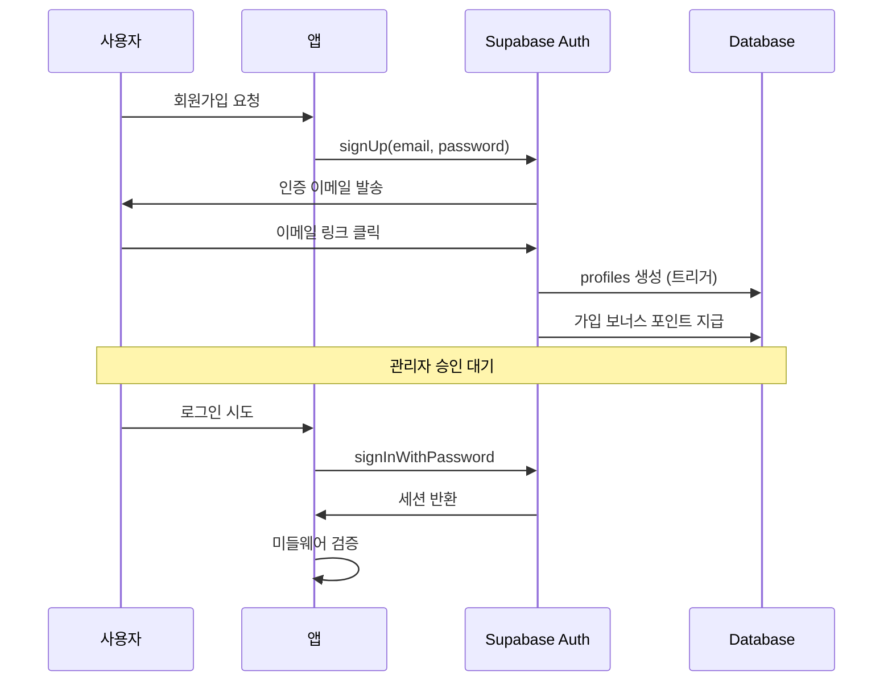

# 04. 인증 시스템

## 🔐 인증 흐름 개요



---

## 🛡️ 미들웨어 라우트 보호

### 경로 분류

| 분류 | 예시 | 인증 필요 |
|-----|------|----------|
| **퍼블릭** | `/`, `/login`, `/lotto/search` | ❌ |
| **기본 분석** | `/lotto/analysis/stats/numbers` | ❌ |
| **고급 분석** | `/lotto/analysis/stats/regression` | ✅ |
| **번호 생성** | `/lotto/generate/manual-pattern` | ✅ |
| **마이페이지** | `/mypage`, `/points` | ✅ |
| **관리자** | `/admin/*` | ✅ + Admin |

### 미들웨어 로직
```typescript
// 비로그인 시
if (!user) {
  if (isAdvancedPath || isRestrictedPath || !isPublicPath) {
    redirect('/login?callback=' + pathname);
  }
}
```

---

## 👤 역할 기반 접근 제어 (RBAC)

### 역할 구조
```
일반 사용자 (user)
    └── 기본 기능 접근
    
관리자 (admin)
    └── 사용자 관리
    └── 데이터 관리
    └── 전체 기능 접근
```

### 관리자 확인
```sql
-- admin_users 테이블
CREATE TABLE admin_users (
  user_id UUID PRIMARY KEY REFERENCES auth.users(id),
  created_at TIMESTAMPTZ DEFAULT NOW()
);

-- 관리자 확인 함수
CREATE FUNCTION is_admin() RETURNS BOOLEAN AS $$
  SELECT EXISTS (
    SELECT 1 FROM admin_users WHERE user_id = auth.uid()
  );
$$ LANGUAGE SQL SECURITY DEFINER;
```

---

## 📧 이메일 인증 흐름

1. **회원가입** → Supabase가 인증 이메일 발송
2. **이메일 클릭** → `/auth/confirm` 리다이렉트
3. **인증 완료** → `email_confirmed_at` 업데이트
4. **트리거 실행** → `user_profiles` 생성 + 가입 보너스

### 가입 보너스 트리거
```sql
CREATE FUNCTION handle_new_user()
RETURNS TRIGGER AS $$
BEGIN
  -- 프로필 생성
  INSERT INTO user_profiles (user_id, nickname)
  VALUES (NEW.id, NEW.email);
  
  -- 포인트 지급 (1000P)
  INSERT INTO user_points (user_id, balance, total_earned)
  VALUES (NEW.id, 1000, 1000);
  
  RETURN NEW;
END;
$$ LANGUAGE plpgsql;
```

---

## 🔧 바이브코딩 팁

### RLS 권한 문제 대응

| 에러 | 원인 | 해결 |
|-----|-----|-----|
| `401 Unauthorized` | 세션 만료 또는 RLS 정책 | 세션 갱신, 정책 확인 |
| 프로필 안 보임 | SELECT 정책 없음 | 본인 조회 정책 추가 |
| 가입 실패 | 트리거 권한 부족 | `SECURITY DEFINER` 사용 |

### 효과적인 프롬프트
```
Supabase로 이메일 인증 회원가입 구현해줘.
- 가입 시 user_profiles 테이블에 자동 생성
- 가입 보너스 1000 포인트 지급
- RLS로 본인 프로필만 조회 가능
- 미들웨어로 /mypage는 로그인 필수
```

### 피해야 할 것
- ❌ 클라이언트에서 admin 체크 (서버에서 해야 함)
- ❌ 미들웨어 없이 페이지 보호 시도
- ❌ RLS 테스트 안 하고 배포
